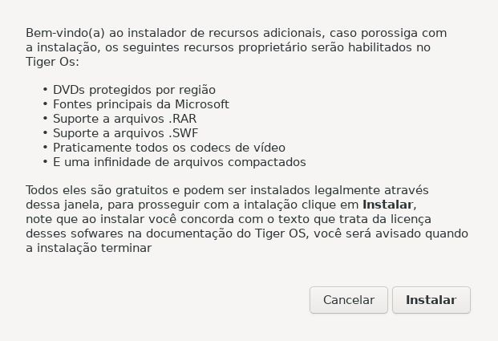
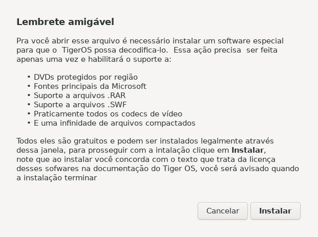

# Será descontinuado aqui,terá um instalador universal que é o : [deb-manager-gui](https://github.com/selrahcsan/deb-manager-gui)

# Instalador de codecs
Se um usuário tentar abrir um arquivo que depende de codecs/softwares proprietários ou que não podem ser distribuidos junto com o TigerOs, esse instalador fará instalação, note que ele instalaraá todos de uma vez

# Screenshots

 Quando executado a partir do menu

 Quando executado ao tentar abrir um arquivo que não é suportado

